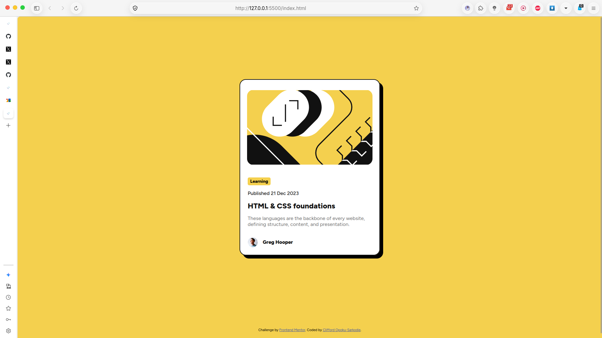

# Frontend Mentor - Blog Preview Card Solution

This is my solution to the [Blog preview card challenge](https://www.frontendmentor.io/challenges/blog-preview-card-ckPaj01IcS) from Frontend Mentor.

## Table of Contents

- [Overview](#overview)
	- [The Challenge](#the-challenge)
	- [Screenshot](#screenshot)
	- [Links](#links)
- [My Process](#my-process)
	- [Built With](#built-with)
	- [What I Learned](#what-i-learned)
	- [Continued Development](#continued-development)
	- [Useful Resources](#useful-resources)
	- [AI Collaboration](#ai-collaboration)
- [Author](#author)
- [Acknowledgments](#acknowledgments)

## Overview

### The Challenge

Users should be able to:

- View the blog preview card at different screen sizes.
- Read the article category, publication date, title, description, and author information.
- See a clear visual layout that matches the provided design.

### Screenshot

### Links

- Solution URL: This project repository
- Live Site URL: Not deployed yet

## My Process

### Built With

- Semantic HTML5 markup
- CSS Flexbox
- CSS Grid
- Responsive CSS sizing
- Google Fonts with Figtree

### What I Learned

- How to structure a content card using semantic HTML.
- How to use the `time` element for a machine-readable publication date.
- How to keep a card responsive with `min()`, percentages, and `calc()`.
- How to align an avatar and author name with Flexbox.
- How to use CSS Grid to center the main content area.

### Continued Development

- Add and test hover and focus states for interactive elements.
- Test the layout across more viewport sizes and browsers.
- Deploy the project and add the live URL to this README.
- Continue improving accessibility and visual accuracy against the reference design.

### Useful Resources

- [Frontend Mentor](https://www.frontendmentor.io/) - Challenge brief and design assets.
- [MDN Web Docs](https://developer.mozilla.org/) - Reference for HTML and CSS features.
- [Google Fonts](https://fonts.google.com/specimen/Figtree) - Figtree font family used in the project.

### AI Collaboration

I used GitHub Copilot to review the HTML structure, clarify semantic HTML and CSS concepts, and identify responsive styling improvements. The implementation was tested and adjusted in the project files.

## Author

- Website: [Clifford Opoku-Sarkodie](https://cliffdetech.dev)

## Acknowledgments

Thanks to [Frontend Mentor](https://www.frontendmentor.io/) for providing the challenge and design resources.
